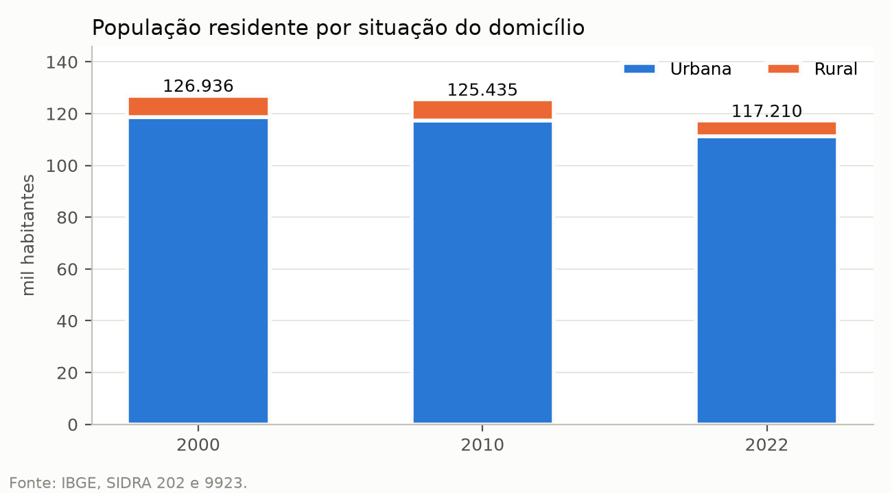
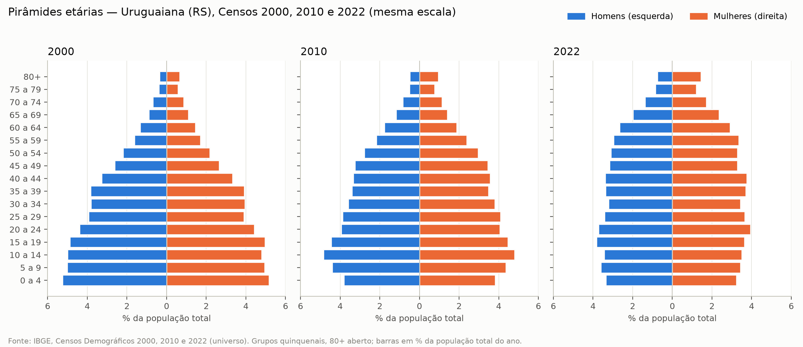
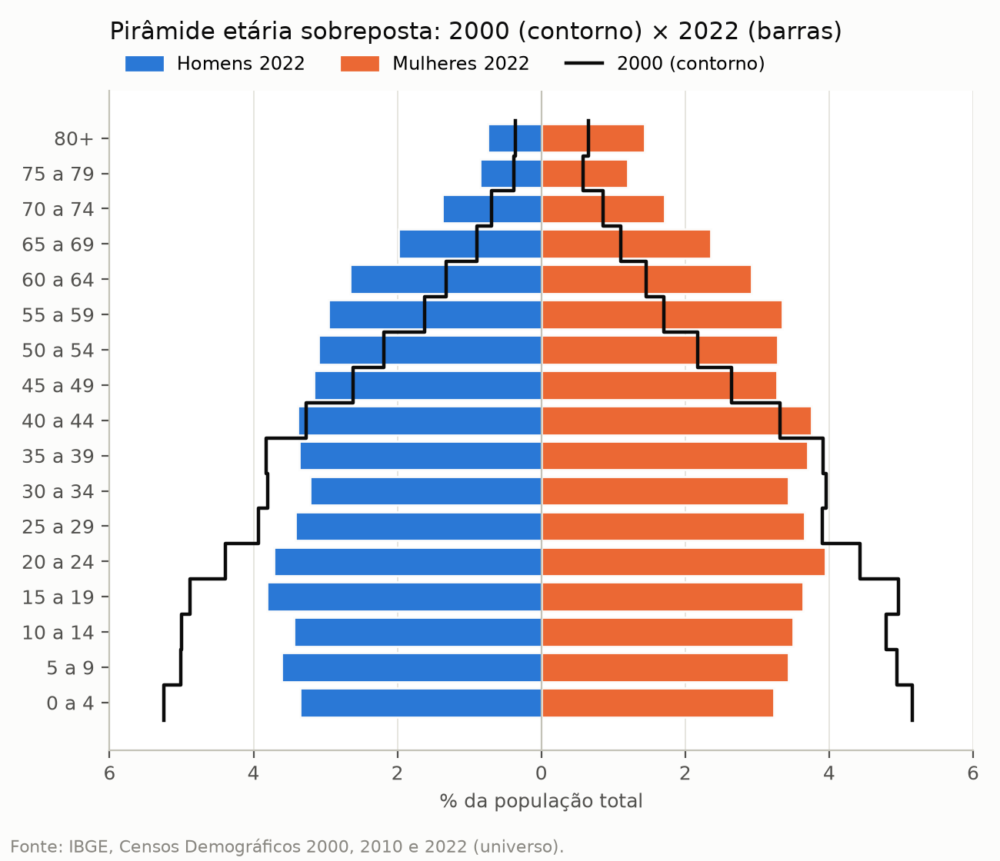
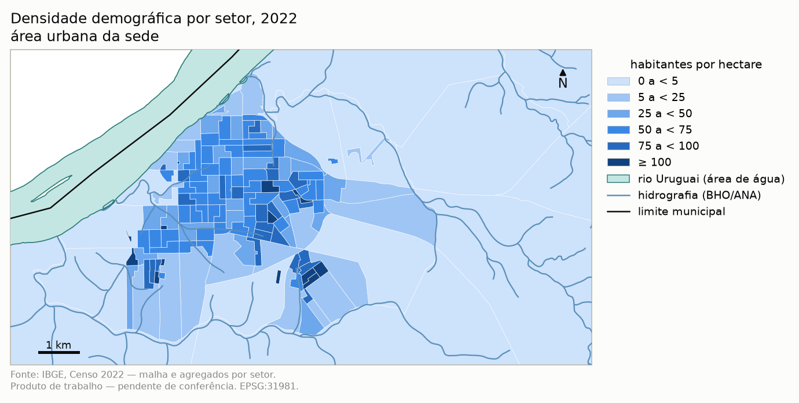
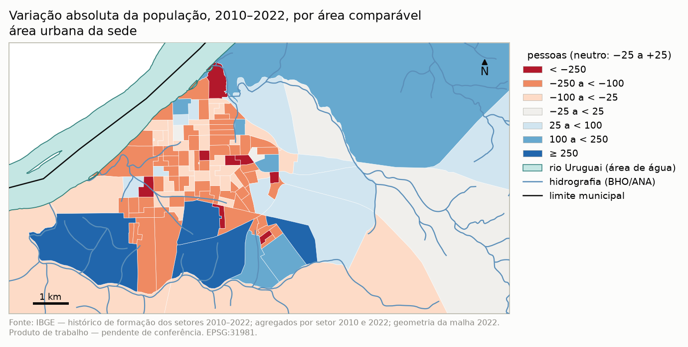
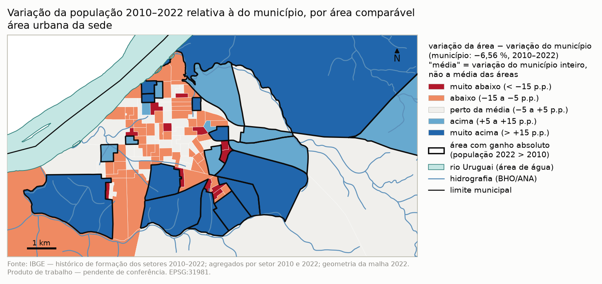
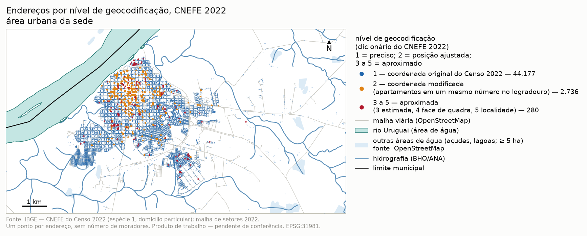
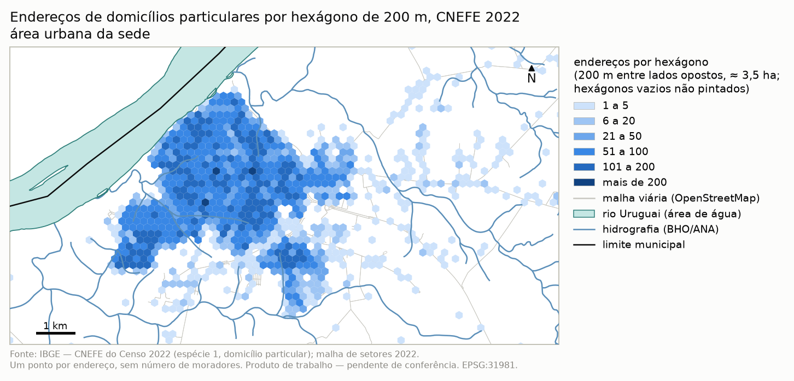
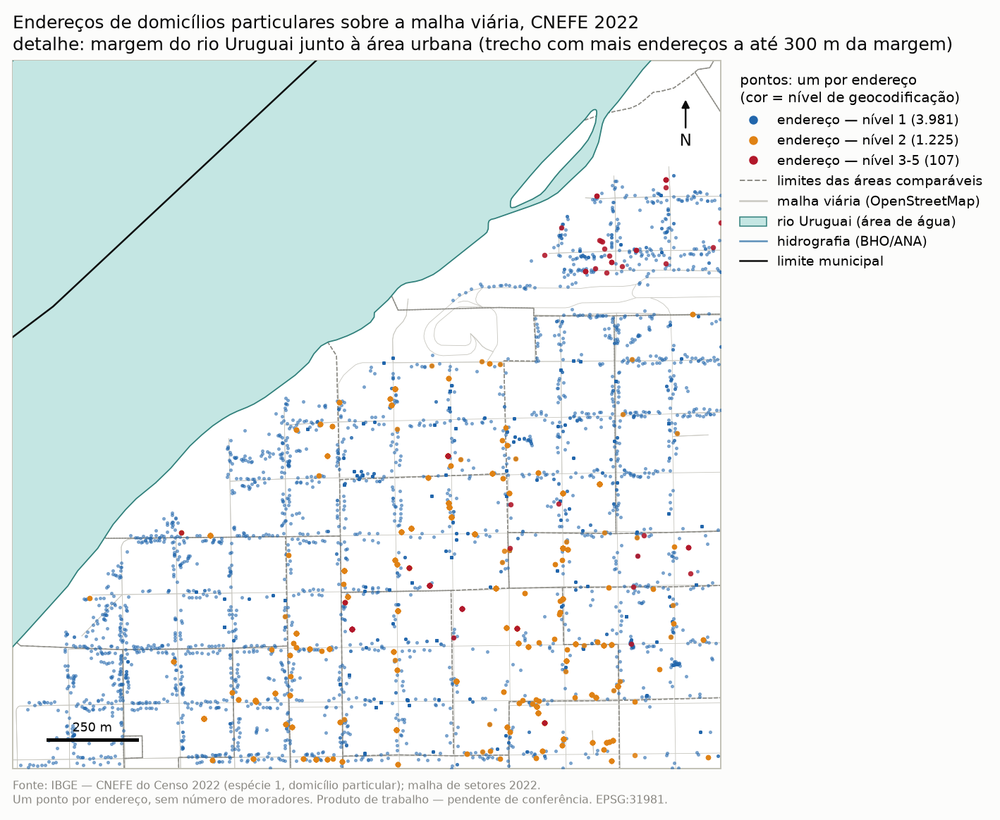

# Dinâmica populacional de Uruguaiana (RS), 2000–2022

**Status:** produto de trabalho, pendente de conferência dos mapas pelo responsável. Nada deste material está ligado ao geoportal.
**Município:** Uruguaiana (RS), código IBGE 4322400. **CRS:** SIRGAS 2000 / UTM 21S (EPSG:31981).
**Fontes:** só produtos padrão do IBGE (resultados do universo dos Censos 2000, 2010 e 2022, agregados por setor censitário, grade estatística, CNEFE e histórico de formação dos setores). Cada tabela e figura tem um `.json` irmão com fonte e transformação.

Esta nota responde, em ordem, a cinco perguntas: quantas pessoas e domicílios havia; como mudou a estrutura etária; onde mora mais e menos gente em 2022; que partes da cidade ganharam e perderam população entre 2010 e 2022; e se a população está se deslocando dentro da cidade.

## 1. Quantas pessoas e domicílios

| | 2000 | 2010 | 2022 |
|---|---:|---:|---:|
| População residente | 126.936 | 125.435 | 117.210 |
| Urbana | 118.538 | 117.415 | 111.272 |
| Rural | 8.398 | 8.020 | 5.938 |
| % urbana | 93,4 | 93,6 | 94,9 |
| Homens / mulheres | 62.755 / 64.181 | 61.009 / 64.426 | 56.449 / 60.761 |
| Domicílios particulares permanentes ocupados | 34.558 | 37.422 | 41.707 |
| Moradores por domicílio | 3,64 | 3,32 | 2,79 |
| Domicílios com um só morador | 3.735 (10,8 %) | 4.863 (13,0 %) | ≥ 8.195 (≥ 19,6 %) |

Fontes: SIDRA 202 e 9923 (população e situação), 9514 (sexo em 2022), 185, 3451 e 4712 (domicílios); moradores de 2000 e domicílios unipessoais de 2022 somados dos agregados por setor (em 2022, cinco setores têm o dado sob sigilo, por isso o valor é mínimo). Tabelas: [`populacao-sexo-situacao`](tabelas/populacao-sexo-situacao_ibge-censo_2000-2022_municipal.csv), [`domicilios`](tabelas/domicilios_ibge-censo_2000-2022_municipal.csv).

A população caiu nos dois intervalos: −1.501 pessoas entre 2000 e 2010 (−1,2 %; −0,12 % ao ano) e −8.225 entre 2010 e 2022 (−6,6 %; −0,56 % ao ano). A rural caiu mais depressa (−26,0 % entre 2010 e 2022). No mesmo período, o número de domicílios ocupados **cresceu** 11,4 % (2010–2022), e o tamanho médio do domicílio caiu de 3,32 para 2,79 pessoas. Os domicílios de uma pessoa só passaram de cerca de um em dez para cerca de um em cinco.

Por distrito (SIDRA 202 e 9923), o distrito-sede concentra 96 % da população em 2022 (112.545). Os quatro distritos rurais perderam população entre 2010 e 2022: João Arregui (−21,9 %), São Marcos (−21,0 %), Plano Alto (−12,4 %) e Vertentes (−4,5 %). Em São Marcos a população urbana triplicou (522 → 1.523) e a rural caiu na mesma proporção, o que indica reclassificação de área rural em urbana, não migração. Tabela: [`populacao-distritos`](tabelas/populacao-distritos_ibge-censo_2000-2022_distrito.csv).

Todos os totais foram conferidos com o SIDRA: a soma dos setores, a soma das idades simples, homens + mulheres e a soma dos distritos fecham **sem diferença** nos três censos ([`conferencia-totais`](tabelas/conferencia-totais_ibge-censo_2000-2022_municipal.csv)).

## 2. Como mudou a estrutura etária

| Indicador | 2000 | 2010 | 2022 |
|---|---:|---:|---:|
| % 0–14 anos | 30,2 | 26,0 | 20,6 |
| % 15–59 anos | 61,5 | 63,0 | 62,2 |
| % 60 anos ou mais | 8,3 | 10,9 | 17,3 |
| % 80 anos ou mais | 1,0 | 1,4 | 2,2 |
| Índice de envelhecimento (60+ por 100 de 0–14) | 27,6 | 42,0 | 83,9 |
| Razão de dependência total (por 100 de 15–59) | 62,5 | 58,6 | 60,8 |
| — jovem | 49,0 | 41,3 | 33,1 |
| — idosa | 13,5 | 17,3 | 27,7 |
| Razão de sexos (homens por 100 mulheres) | 97,8 | 94,7 | 92,9 |
| Idade mediana (anos) | 25,7 | 29,4 | 35,4 |

Fonte: SIDRA 1552 (2000 e 2010, universo, idade simples) e 9514 (2022). Tabela: [`indicadores-etarios`](tabelas/indicadores-etarios_ibge-censo_2000-2022_municipal.csv).

A base da pirâmide encolheu e o topo alargou. Em 22 anos, a fatia de crianças e adolescentes caiu um terço e a de pessoas com 60 anos ou mais dobrou; o índice de envelhecimento triplicou. A razão de dependência total quase não mudou, mas mudou de composição: a dependência jovem caiu e a idosa dobrou. A idade mediana subiu dez anos. A pirâmide sobreposta mostra a mudança grupo a grupo:

## 3. Onde há mais e menos gente em 2022

A área urbana da sede reúne 109.257 pessoas em cerca de 5.950 ha (18 hab/ha em média), enquanto os setores rurais somam 5.938 pessoas em cerca de 5.630 km². Dentro da cidade, 40 setores com 75 hab/ha ou mais abrigam 23 % da população municipal. Os bairros oficiais (IBGE 2022) mais populosos são União das Vilas (9.352), São João (9.085), Tabajara Brites (8.738) e Centro (8.534). A grade estatística de 200 m mostra a mesma concentração: os 10 % de células urbanas habitadas mais cheias reúnem cerca de 30 % da população dessas células, com até 589 pessoas por célula.

O envelhecimento não é homogêneo: Centro (24,3 % de pessoas com 60+), Bela Vista (23,8 %) e São Miguel (23,3 %) são os bairros mais envelhecidos; as franjas da cidade têm as maiores proporções de crianças de 0 a 14 anos (Distrito Rodoviário 30,5 %, Salso de Baixo 29,2 %, Tabajara Brites 28,2 %, União das Vilas 26,5 %; no Centro, 13,9 %). Fonte: agregados por setor 2022 e grade estatística 2022. Tabela: [`populacao-setores`](tabelas/populacao-setores_ibge-censo_2022_setor.csv).

| Tema | Município | Área urbana da sede |
|---|---|---|
| Densidade (hab/ha) | [mapa](mapas_v2/densidade-populacional_ibge-censo_2022_setor_municipio.png) | [mapa](mapas_v2/densidade-populacional_ibge-censo_2022_setor_urbano.png) |
| % 60 anos ou mais | [mapa](mapas_v2/idosos-60-mais_ibge-censo_2022_setor_municipio.png) | [mapa](mapas_v2/idosos-60-mais_ibge-censo_2022_setor_urbano.png) |
| % 0–14 anos | [mapa](mapas_v2/criancas-0-14_ibge-censo_2022_setor_municipio.png) | [mapa](mapas_v2/criancas-0-14_ibge-censo_2022_setor_urbano.png) |
| % domicílios com um morador | [mapa](mapas_v2/domicilios-unipessoais_ibge-censo_2022_setor_municipio.png) | [mapa](mapas_v2/domicilios-unipessoais_ibge-censo_2022_setor_urbano.png) |
| População na grade | [mapa](mapas_v2/populacao-grade_ibge-censo_2022_200m-1km_municipio.png) | [mapa](mapas_v2/populacao-grade_ibge-censo_2022_200m-1km_urbano.png) |

## 4. Que partes da cidade ganharam e perderam população (2010–2022)

A comparação usa **áreas comparáveis**, montadas com o histórico oficial de formação dos setores 2010–2022 do IBGE: cada área junta os setores de 2010 e de 2022 que cobrem o mesmo território. As contagens vêm só das tabelas do Censo; a geometria, só da malha de 2022. São 148 áreas: 126 equivalem a um setor só (1:1), 20 são um setor de 2010 dividido em dois a seis setores de 2022, e duas juntam dois setores de 2010. A soma das áreas fecha exatamente com o total municipal nos dois anos (125.435 e 117.210 pessoas; 37.422 e 41.707 domicílios).

121 áreas perderam população e 27 ganharam. Com limiares fixos de ±5 % e ±20 %:

| Classe | Áreas | População 2010 | População 2022 |
|---|---:|---:|---:|
| Perda forte (< −20 %) | 25 | 17.067 | 12.640 |
| Perda (−20 a −5 %) | 87 | 77.478 | 67.348 |
| Estável (−5 a +5 %) | 15 | 13.783 | 13.756 |
| Ganho (+5 a +20 %) | 12 | 11.545 | 12.869 |
| Ganho forte (> +20 %) | 9 | 5.562 | 10.597 |

Com ±10 % em vez de ±5 %, 24 áreas mudam de classe (20 passam de "perda" e 4 de "ganho" para "estável"); o quadro geral não muda. Em 67 áreas a população caiu enquanto o número de domicílios subiu — o mesmo encolhimento do domicílio visto no município.

O maior ganho está em Tabajara Brites, a sudoeste (+3.640 pessoas; domicílios de 627 para 1.829), seguido de Vila Júlia, Salso de Baixo e Jardim do Salso, ao sul e sudeste. As maiores perdas, de 235 a 510 pessoas cada, estão em bairros consolidados entre 1 e 4 km do centro (Vila Júlia, União das Vilas, Emílio Brandi, São Miguel, São João, Mascarenhas de Moraes, Nova Esperança). Lista completa: [`top10`](tabelas/populacao-mudanca-top10_ibge-censo_2010-2022_area-comparavel.csv).

Mapas: variação absoluta ([município](mapas_v2/populacao-variacao-absoluta_ibge-censo_2010-2022_area-comparavel_municipio.png), [urbano](mapas_v2/populacao-variacao-absoluta_ibge-censo_2010-2022_area-comparavel_urbano.png)); classes de variação % ([município](mapas_v2/populacao-variacao-classes_ibge-censo_2010-2022_area-comparavel_municipio.png), [urbano](mapas_v2/populacao-variacao-classes_ibge-censo_2010-2022_area-comparavel_urbano.png)).

## 5. A população está se deslocando dentro da cidade?

Sim, pouco, e para fora do miolo. O centro médio da população (ponderado pela população de cada área comparável) andou cerca de 290 m para sudoeste entre 2010 e 2022 (250 m, também para sudoeste, considerando só as áreas urbanas). A distância-padrão das áreas urbanas caiu de 6,2 para 5,8 km.

| Distância ao centro | Pop. 2010 | Pop. 2022 | Variação | % do total 2010 → 2022 |
|---|---:|---:|---:|---:|
| 0–1 km | 14.817 | 13.658 | −7,8 % | 11,8 → 11,7 |
| 1–2 km | 33.679 | 29.153 | −13,4 % | 26,8 → 24,9 |
| 2–3 km | 34.299 | 30.538 | −11,0 % | 27,3 → 26,1 |
| 3–5 km | 33.108 | 35.254 | +6,5 % | 26,4 → 30,1 |
| 5–10 km | 386 | 425 | +10,1 % | 0,3 → 0,4 |
| > 10 km | 9.146 | 8.182 | −10,5 % | 7,3 → 7,0 |

A faixa de 3 a 5 km do centro (bairro Centro do IBGE) foi a única grande que ganhou gente; as faixas de 1 a 3 km perderam mais de 8 mil pessoas. Por quadrante, o sudeste segue com mais da metade da população (54 %) mas perdeu 8,3 %; o sudoeste perdeu só 1,9 % e subiu de 30,1 % para 31,6 % do total. O movimento é, portanto, de esvaziamento relativo dos bairros intermediários e de crescimento das franjas sul e sudoeste. Tabelas: [`faixa-distancia`](tabelas/populacao-faixa-distancia-centro_ibge-censo_2010-2022_area-comparavel.csv), [`quadrante`](tabelas/populacao-quadrante_ibge-censo_2010-2022_area-comparavel.csv).

## 6. Leitura relativa à média do município

As classes da seção 4 medem ganho e perda em relação a zero. Como o município inteiro perdeu população, a maioria das áreas cai em "perda". A leitura relativa compara cada área com o município: **diferença, em pontos percentuais (p.p.), entre a variação % da área e a variação % do município** (−6,56 % na população; +11,45 % nos domicílios, 2010–2022). "Média" aqui é a variação do município inteiro (a soma das áreas, que fecha com o total do Censo), não a média simples das 148 áreas. Classes fixas: muito abaixo da média (< −15 p.p.), abaixo (−15 a −5), perto da média (−5 a +5), acima (+5 a +15), muito acima (> +15).

**População** (variação do município: −6,56 %):

| Classe relativa | Áreas | População 2022 | % da população 2022 | Áreas com ganho absoluto |
|---|---:|---:|---:|---:|
| Muito abaixo da média (< −15 p.p.) | 20 | 10.080 | 8,6 | 0 |
| Abaixo da média (−15 a −5 p.p.) | 61 | 43.533 | 37,1 | 0 |
| Perto da média (−5 a +5 p.p.) | 38 | 32.436 | 27,7 | 0 |
| Acima da média (+5 a +15 p.p.) | 11 | 10.110 | 8,6 | 9 |
| Muito acima da média (> +15 p.p.) | 18 | 21.051 | 18,0 | 18 |

"Perto da média" quer dizer perder população no ritmo do município (de −11,1 % a −1,8 % nessas áreas): nenhuma das 38 ganhou gente. "Acima da média" reúne 11 áreas, 9 com ganho absoluto e 2 que perderam menos de 1 % (por isso o contorno, nos mapas, marca à parte as áreas que ganharam população de fato). Com limiares de ±10 e ±20 p.p. em vez de ±5 e ±15, 53 das 148 áreas mudam de classe — quase todas para a classe vizinha mais próxima da média (35 passam de "abaixo" para "perto"); nenhuma muda de lado.

**Domicílios** (variação do município: +11,45 %):

| Classe relativa | Áreas | Domicílios 2010 | Domicílios 2022 | Áreas com ganho absoluto |
|---|---:|---:|---:|---:|
| Muito abaixo da média (< −15 p.p.) | 28 | 5.847 | 5.320 | 0 |
| Abaixo da média (−15 a −5 p.p.) | 47 | 13.129 | 13.210 | 24 |
| Perto da média (−5 a +5 p.p.) | 38 | 10.689 | 11.850 | 38 |
| Acima da média (+5 a +15 p.p.) | 12 | 3.023 | 3.676 | 12 |
| Muito acima da média (> +15 p.p.) | 20 | 4.734 | 7.651 | 20 |
| Sem valor (só domicílio coletivo) | 3 | 0 | 0 | — |

Com ±10 e ±20 p.p., 42 áreas mudam de classe, também só para a classe vizinha.

**Cruzamento população × domicílios** (sentido da variação absoluta, em número de áreas):

| População \ Domicílios | ganhou | igual | perdeu | sem domicílio particular |
|---|---:|---:|---:|---:|
| Ganhou | 27 | 0 | 0 | 0 |
| Perdeu | 67 | 4 | 47 | 3 |

**67 áreas perderam população e ganharam domicílios** (54.866 moradores em 2022, 47 % do município): é o encolhimento do domicílio visto na escala da cidade. Todas as 27 áreas que ganharam população também ganharam domicílios. Nas classes relativas, a leitura das duas variáveis coincide na maior parte das áreas (95 de 145 com valor nas duas ficam na mesma classe). Tabelas: [`populacao-variacao-relativa-classes`](tabelas/populacao-variacao-relativa-classes_ibge-censo_2010-2022_area-comparavel.csv), [`domicilios-variacao-relativa-classes`](tabelas/domicilios-variacao-relativa-classes_ibge-censo_2010-2022_area-comparavel.csv), [`cruzamento`](tabelas/populacao-domicilios-cruzamento_ibge-censo_2010-2022_area-comparavel.csv). As colunas `dif_pp_pop`, `classe_rel_pop`, `dif_pp_dom`, `classe_rel_dom` (e as variantes `_lim10_20` e `ganho_absoluto_*`) foram acrescentadas à tabela [`populacao-mudanca`](tabelas/populacao-mudanca_ibge-censo_2010-2022_area-comparavel.csv).

Mapas: população relativa ([município](mapas_v2/populacao-variacao-relativa_ibge-censo_2010-2022_area-comparavel_municipio.png), [urbano](mapas_v2/populacao-variacao-relativa_ibge-censo_2010-2022_area-comparavel_urbano.png)); domicílios relativos ([município](mapas_v2/domicilios-variacao-relativa_ibge-censo_2010-2022_area-comparavel_municipio.png), [urbano](mapas_v2/domicilios-variacao-relativa_ibge-censo_2010-2022_area-comparavel_urbano.png)). Paleta divergente centrada na variação do município. Contorno preto: no mapa da população, as áreas com ganho absoluto de moradores; no dos domicílios, as que **perderam** domicílios (quase todas ganharam, então o contorno marca a exceção).

Os 14 mapas das seções 3 e 4 estão em [`mapas_v2/`](mapas_v2/), sem o símbolo do centro da cidade e sem os marcadores do centro médio da população (o centro segue só como referência de cálculo das faixas de distância, e o deslocamento do centro médio fica no texto e nas tabelas da seção 5).

**Nota sobre o rio nos mapas de `mapas_v2/`.** O rio Uruguai é desenhado como área de água (polígono do OpenStreetMap, com a linha da margem), por cima dos setores, áreas comparáveis, células e hexágonos, que na malha oficial vão até o eixo do rio; açudes e lagoas da mesma fonte também aparecem (no mapa do município, só os de 20 ha ou mais). É só apresentação: nenhuma área, densidade ou contagem foi recalculada — a densidade continua calculada pela área oficial do setor, que inclui a parte coberta pelo rio.

## 7. Endereços residenciais

**O que o ponto é e o que não é.** Cada ponto é um endereço de domicílio particular do Cadastro Nacional de Endereços para Fins Estatísticos (CNEFE) do Censo 2022 — 47.193 pontos, o mesmo total de domicílios particulares dos agregados por setor. O ponto **não** traz número de moradores nem diz se o domicílio estava ocupado: a população continua vindo do setor censitário ou da grade estatística. Os pontos servem para ver *onde* estão as moradias, rua a rua, e onde se empilham. A camada de pontos fica fora do repositório versionado; aqui entram só as imagens e contagens agregadas.

**Qualidade das coordenadas** (nível de geocodificação, conforme o dicionário do CNEFE 2022 do IBGE):

| Nível | Significado (dicionário IBGE) | Endereços | % | Em coordenada repetida |
|---|---|---:|---:|---:|
| 1 | Endereço — coordenada original do Censo 2022 | 44.177 | 93,6 | 6.540 |
| 2 | Endereço — coordenada modificada (apartamentos em um mesmo número no logradouro) | 2.736 | 5,8 | 2.728 |
| 3 | Endereço — coordenada estimada (sem coordenada ou coordenada inválida na origem) | 219 | 0,5 | 110 |
| 4 | Face de quadra | 48 | 0,1 | 30 |
| 5 | Localidade | 13 | 0,03 | 10 |

Nenhum ponto tem nível 6 (setor censitário). Os níveis 2 a 4 estão todos em setores urbanos; os 13 de nível 5, em setores rurais. **Coordenada repetida:** 9.418 endereços (20,0 %) dividem a coordenada com outro endereço, em 2.201 locais — 1.395 locais com 2 endereços, 368 com 3 a 5, 391 com 6 a 20 e 47 com mais de 20 (até 77 num mesmo ponto: prédios e conjuntos). Num mapa de pontos esses endereços aparecem como um ponto só; por isso há também o mapa por hexágono. **Fora do município ou de setor:** nenhum ponto está fora do limite municipal nem fora da malha de setores de 2022 (1.784 pontos caem fora do polígono do setor atribuído a eles pelo código; metade a até 5 m dele e 90 % a até 47 m — pontos na própria divisa entre setores). Tabela: [`enderecos-qualidade`](tabelas/enderecos-qualidade_ibge-cnefe_2022_municipal.csv).

| Mapa | Município inteiro | Área urbana da sede |
|---|---|---|
| Pontos dos endereços | [mapa](mapas_v2/enderecos-pontos_ibge-cnefe_2022_pontos_municipio.png) | [mapa](mapas_v2/enderecos-pontos_ibge-cnefe_2022_pontos_urbano.png) |
| Nível de geocodificação | [mapa](mapas_v2/enderecos-nivel-geocodificacao_ibge-cnefe_2022_pontos_municipio.png) | [mapa](mapas_v2/enderecos-nivel-geocodificacao_ibge-cnefe_2022_pontos_urbano.png) |
| Endereços por hexágono de 200 m | [mapa](mapas_v2/enderecos-densidade-hexagono_ibge-cnefe_2022_hex200m_municipio.png) | [mapa](mapas_v2/enderecos-densidade-hexagono_ibge-cnefe_2022_hex200m_urbano.png) |

O hexágono tem 200 m entre lados opostos (cerca de 3,5 ha); o mais cheio reúne 231 endereços. A malha viária de fundo é a do OpenStreetMap (só referência visual); ela não tem todas as ruas dos loteamentos novos, que aparecem pelos próprios pontos.

**Recortes de detalhe** (escolhidos pelos dados, não à mão):

- **Área que mais ganhou população** — área comparável AC109, bairro Tabajara Brites: 2.362 → 6.002 pessoas e 627 → 1.829 domicílios ocupados; 1.915 endereços do CNEFE dentro da área, concentrados em quadras novas no canto nordeste de uma área grande e quase vazia (o mapa enquadra só essas quadras, com folga de cerca de 150 m). [mapa](mapas_v2/enderecos-detalhe-ganho_ibge-cnefe_2022_pontos_urbano.png)
- **Área que mais perdeu população** — área comparável AC046, bairro Vila Júlia: 1.597 → 1.087 pessoas (−510; −31,9 %) e 438 → 369 domicílios ocupados; 386 endereços dentro da área. [mapa](mapas_v2/enderecos-detalhe-perda_ibge-cnefe_2022_pontos_urbano.png)
- **Margem do rio Uruguai junto à área urbana** — janela de 2 km centrada no trecho com mais endereços urbanos a até 300 m da **margem** (borda da área de água do rio, OpenStreetMap), nos bairros Bela Vista, Centro e Mascarenhas de Moraes (5.313 endereços na janela). O endereço mais próximo da margem está a cerca de 37 m; 88 endereços urbanos estão a até 100 m dela, 1.179 a até 300 m e 2.507 a até 500 m. Nenhum endereço cai dentro do rio (6 caem em açudes do mapeamento do OpenStreetMap). A medida anterior, até o eixo do rio, dava cerca de 420 m. [mapa](mapas_v2/enderecos-detalhe-rio_ibge-cnefe_2022_pontos_urbano.png)

## Limites dos dados

- **Sigilo de 2022.** O IBGE suprime ("X") células com poucos casos. Aqui elas ficam como ausentes, nunca como zero: faltam % 0–14 em 8 setores (691 pessoas, 0,6 %), % 60+ em 7 (845 pessoas, 0,7 %), moradores por domicílio em 3 e % de domicílios unipessoais em 5. População, domicílios e densidade não têm sigilo.
- **Áreas comparáveis maiores que o setor.** 22 das 148 áreas juntam mais de um setor; nas áreas rurais elas são muito extensas e o centróide é uma posição grosseira. A distância ao centro e o quadrante são calculados pelo centróide de cada área.
- **Setores de 2010 sem tabela ou só com domicílio coletivo.** Dois setores de 2010 não têm linha nos agregados (o IBGE omite setores sem moradores) e contam como zero; três setores têm moradores só em domicílios coletivos e entram na população, com zero domicílios particulares. A soma fecha com o total municipal.
- **2000 dentro da cidade.** Não há correspondência oficial setor 2000 ↔ setor 2010: o histórico do IBGE começa em 2010. A malha de 2000 tem CRS de origem inferido (SAD69), seis geometrias inválidas, sobreposição interna de 0,5 km² e encaixe fraco com 2010 (metade da área em comum, na mediana, entre setores de mesmo código). Por isso 2000 fica nos níveis município e distrito. Para ir além seria preciso uma correspondência 2000–2010 oficial ou a reconstrução setor a setor com as descrições de limites dos dois censos.
- **CNEFE.** Os endereços vêm com o código do setor da malha preliminar de 2022. O setor final foi atribuído pela ligação oficial do IBGE e, nos setores divididos, pela posição do ponto. O total de endereços de domicílios particulares (47.193) é igual ao dos agregados; 147 de 179 setores batem exatamente.

## O que isto prepara

- **Exposição a inundação.** A camada de endereços de domicílios do CNEFE 2022 (47.193 pontos, com setor e logradouro) permite contar domicílios e estimar moradores dentro das manchas de cota de cheia já existentes no repositório. Isso ainda não foi feito aqui.
- **Acessibilidade.** As áreas comparáveis, a grade e os pontos do CNEFE servem de origem para medir o acesso às unidades de saúde (CNES) pela rede viária (OSM e DNIT), inclusive com vias e pontes interrompidas. Isso ainda não foi feito aqui.
