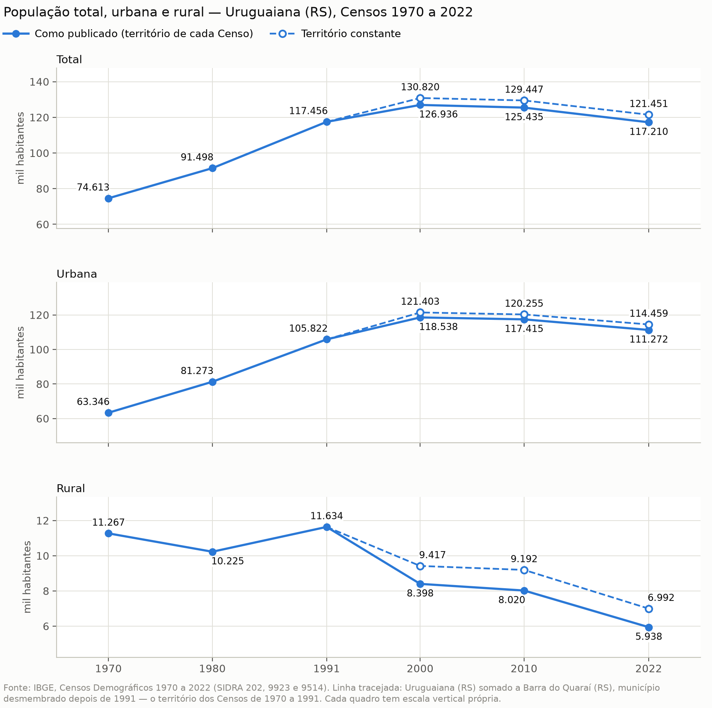
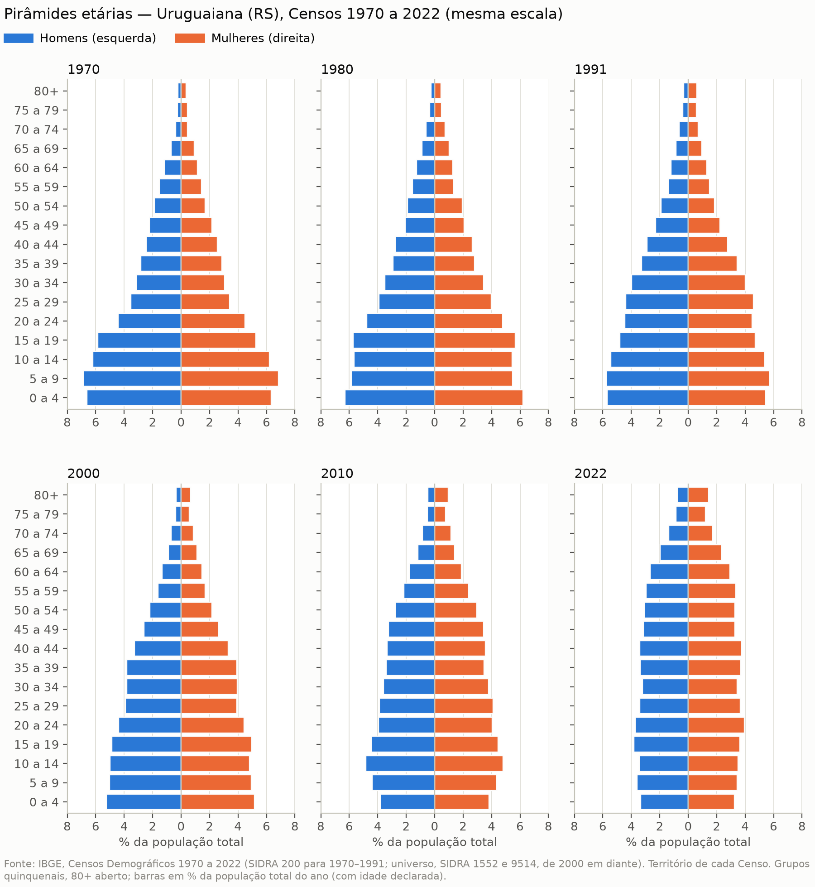
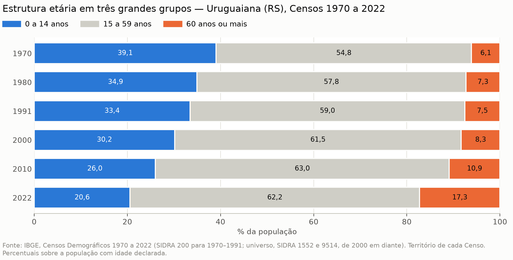
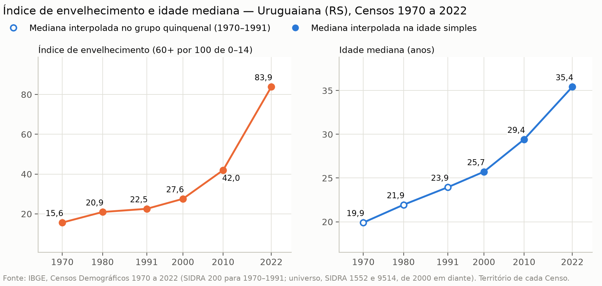

# Série longa da população de Uruguaiana (RS), 1970–2022

**Status:** produto de trabalho, pendente de conferência. Nada deste material está ligado ao geoportal.
**Município:** Uruguaiana (RS), código IBGE 4322400. **Fonte:** só a API de agregados do IBGE (SIDRA). Cada tabela e figura tem um `.json` irmão.

Esta nota estende até 1970 a parte municipal (não espacial) da caracterização de 2000–2022, que continua valendo como está.

## O que a série mostra

| Censo | População (como publicado) | Urbana | Rural | % urbana | População (território constante) |
|---|---:|---:|---:|---:|---:|
| 1970 | 74.613 | 63.346 | 11.267 | 84,9 | 74.613 |
| 1980 | 91.498 | 81.273 | 10.225 | 88,8 | 91.498 |
| 1991 | 117.456 | 105.822 | 11.634 | 90,1 | 117.456 |
| 2000 | 126.936 | 118.538 | 8.398 | 93,4 | 130.820 |
| 2010 | 125.435 | 117.415 | 8.020 | 93,6 | 129.447 |
| 2022 | 117.210 | 111.272 | 5.938 | 94,9 | 121.451 |

Tabelas: [`populacao-sexo-situacao`](tabelas/populacao-sexo-situacao_ibge-censo_1970-2022_municipal.csv), [`populacao-variacao`](tabelas/populacao-variacao_ibge-censo_1970-2022_municipal.csv).

**Cresceu até 2000.** A população aumentou 2,06 % ao ano entre 1970 e 1980 e 2,30 % ao ano entre 1980 e 1991. No território constante, cresceu mais devagar de 1991 a 2000 (+13.364 pessoas; 1,22 % ao ano), ponto mais alto da série.

**Parou entre 2000 e 2010** (−1.373 pessoas; −0,11 % ao ano) **e caiu entre 2010 e 2022** (−7.996; −0,53 % ao ano). Em 2022 o território constante tem 121.451 habitantes, pouco acima de 1991.

**Urbano e rural.** Todo o crescimento foi urbano. A população rural ficou perto de 11 mil até 1991 e depois caiu: 9.417 em 2000 e 6.992 em 2022, no território constante.

**Envelhecimento.** A parcela de 0 a 14 anos caiu de 39,1 % (1970) para 20,6 % (2022) e a de 60 anos ou mais subiu de 6,1 % para 17,3 %. O índice de envelhecimento passou de 15,6 para 83,9 idosos por 100 crianças e a idade mediana, de 19,9 para 35,4 anos. Mais da metade da alta do índice ocorreu depois de 2010.

| Indicador | 1970 | 1980 | 1991 | 2000 | 2010 | 2022 |
|---|---:|---:|---:|---:|---:|---:|
| % 0–14 anos | 39,1 | 34,9 | 33,4 | 30,2 | 26,0 | 20,6 |
| % 60 anos ou mais | 6,1 | 7,3 | 7,5 | 8,3 | 10,9 | 17,3 |
| Índice de envelhecimento | 15,6 | 20,9 | 22,5 | 27,6 | 42,0 | 83,9 |
| Idade mediana (anos) | 19,9* | 21,9* | 23,9* | 25,7 | 29,4 | 35,4 |

\* interpolada dentro do grupo quinquenal. Tabelas: [`indicadores-etarios`](tabelas/indicadores-etarios_ibge-censo_1970-2022_municipal.csv), [`piramide-etaria`](tabelas/piramide-etaria_ibge-censo_1970-2022_municipal.csv).

## Figuras

## Limites

- **Território.** O distrito de Barra do Quaraí foi desmembrado de Uruguaiana pela Lei Estadual nº 10.655, de 28/12/1995, e instalado como município em 1º/01/1997 (IBGE, histórico dos municípios); não há registro de outro desde 1970. A série "como publicado" tem uma quebra entre 1991 e 2000; a "território constante" soma os dois municípios de 2000 em diante. As figuras de idade usam a série publicada.
- **Universo e amostra.** A tabela 200, usada para a idade em 1970–1991, é rotulada "Amostra". Em 2000 e 2010 seu total é igual ao do universo, mas os grupos de 50 anos ou mais diferem em até 277 pessoas; de 2000 em diante ficam os valores do universo.
- **Idade.** Grupos quinquenais, com 80 anos ou mais como grupo aberto comum. As 15 (1970) e 45 (1980) pessoas de idade ignorada ficam fora dos percentuais. A mediana de 1970–1991 é interpolada no grupo quinquenal; depois, na idade simples.
- **O que não existe antes de 2000.** Nenhuma tabela municipal anterior a 1970. Domicílios: só o número em 1970 (14.890) e 1980 (20.577); moradores por domicílio a partir de 1991 (3,90). Ver [`domicilios`](tabelas/domicilios_ibge-censo_1970-2022_municipal.csv).
