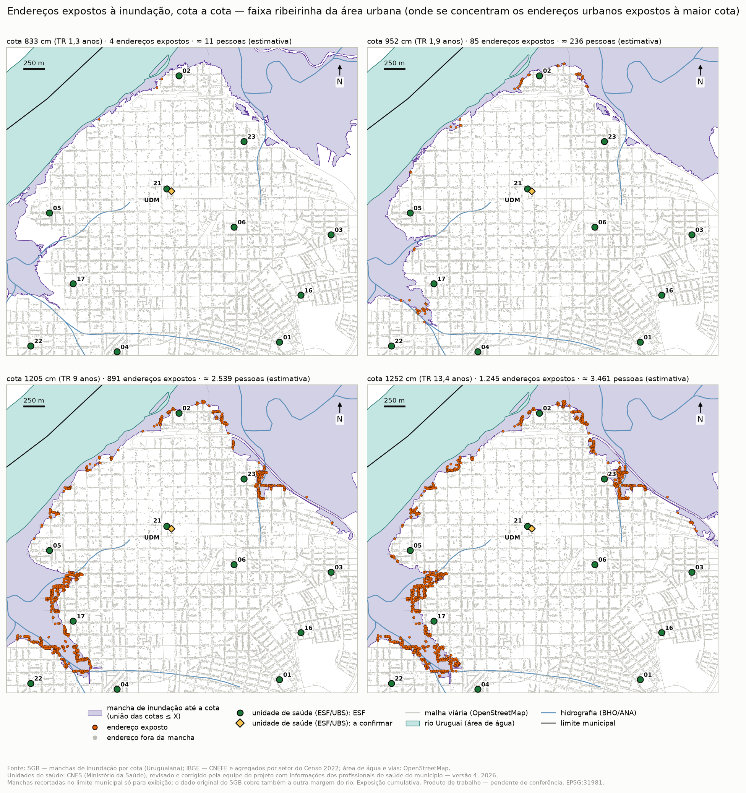
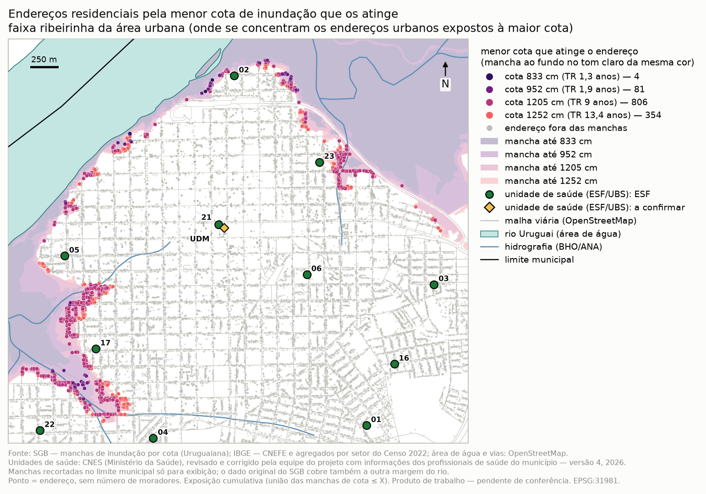

# Exposição à inundação pelos endereços residenciais (Uruguaiana, RS, 2022)

**Status:** produto de trabalho, pendente de conferência. Nada deste material está ligado ao geoportal.
**Município:** código IBGE 4322400. **CRS:** EPSG:31981.

**Fontes:**
- manchas de inundação por cota do rio, do Serviço Geológico do Brasil (SGB), já no repositório;
- CNEFE, agregados por setor e grade estatística do Censo 2022 (IBGE);
- áreas comparáveis 2010–2022;
- unidades de saúde (ESF e UBS): CNES (Ministério da Saúde), revisado e corrigido pela equipe do projeto com informações dos profissionais de saúde do município — versão 4, 2026;
- área de água e vias do OpenStreetMap, só como fundo dos mapas.

Cada tabela e mapa tem um `.json` irmão.

## Resumo

| Cota (cm) | Tempo de retorno (TR) | Endereços expostos | População estimada |
|---:|---:|---:|---:|
| 833 | 1,3 ano | 4 | 12 |
| 952 | 1,9 ano | 85 | 236 |
| 1205 | 9 anos | 891 | 2.539 |
| 1252 | 13,4 anos | 1.245 | 3.461 (3,0 % do município) |

Todos os endereços expostos são urbanos e estão em poucos trechos de beira de rio e de arroio. As cheias frequentes atingem pouca gente. A exposição cresce cerca de dez vezes entre as cotas de 952 e de 1205 cm. A maior parte dos expostos mora em áreas da cidade que perderam moradores entre 2010 e 2022.

## As manchas de inundação

As camadas `COTA_0833cm` a `COTA_1252cm` vêm do serviço "Visualizador das Manchas de Inundação" do SGB. Cada uma traz a cota em centímetros e o tempo de retorno (TR) como atributos.

| Cota | TR (atributo do serviço) | Área da mancha (km²) |
|---|---:|---:|
| 833 cm | 1,3 ano | 28,9 |
| 952 cm | 1,9 ano | 39,4 |
| 1205 cm | 9 anos | 40,6 |
| 1252 cm | 13,4 anos | 41,1 |

As manchas cobrem só o trecho do rio junto à cidade. Incluem o próprio leito e sobem pelos arroios que cortam a área urbana. O dado original cobre também a outra margem do rio; nos mapas, as manchas foram recortadas no limite municipal só para exibição.

## Método

- **Endereço exposto à cota X** é o endereço de domicílio particular do CNEFE 2022 cujo ponto cai dentro da **união das manchas de cota até X**.
  - A contagem é cumulativa: quem é atingido por uma cheia menor conta também nas maiores.
  - As manchas do SGB não se encaixam perfeitamente: 38 endereços estão na mancha de 1205 cm e fora da de 1252 cm.
- **Menor cota que atinge** cada endereço: é o que define as faixas dos mapas.
- **População estimada:** a população de cada setor de 2022 é repartida igualmente entre os endereços do setor e depois somada nos endereços expostos.
  - A soma reproduz o total do município, menos 426 pessoas de três setores que só têm domicílios coletivos.
  - É uma **estimativa**: o Censo não publica moradores por endereço.
  - Sensibilidade: a mesma conta feita pela grade estatística de 2022 (população da célula repartida entre os endereços da célula).
- **Estimativa preliminar descartada:** uma estimativa anterior, que repartia a população do setor pela área coberta pela mancha, foi abandonada. Os setores da beira do rio vão até o eixo do rio, mas as casas ficam na parte alta.

## Endereços e população por cota

| Cota | Endereços | Precisos (nív. 1–2) | Aproximados (nív. 3–5) | Em coordenada repetida (locais) | Menor cota é esta | Pop. estimada (setor) | Pop. estimada (grade) |
|---|---:|---:|---:|---:|---:|---:|---:|
| 833 cm | 4 | 3 | 1 | 2 (1) | 4 | 12 | 11 |
| 952 cm | 85 | 78 | 7 | 20 (6) | 81 | 236 | 265 |
| 1205 cm | 891 | 881 | 10 | 100 (41) | 806 | 2.539 | 2.579 |
| 1252 cm | 1.245 | 1.233 | 12 | 130 (55) | 354 | 3.461 | 3.543 |

A repartição pela grade dá valores de 1,5 % a 12 % maiores nas três cotas mais altas, a mesma ordem de grandeza. Tabela: [`enderecos-populacao-por-cota`](tabelas/enderecos-populacao-por-cota_sgb-ibge-cnefe_2022_municipal.csv). A versão anterior, que tratava cada cota por si, foi guardada com o sufixo `_nao-cumulativo`.

## Quem está exposto

| Cota | % 60+ | % 0–14 | % domicílios com um morador |
|---|---:|---:|---:|
| 952 cm | 15,6 | 22,6 | 17,7 |
| 1205 cm | 15,2 | 24,2 | 16,9 |
| 1252 cm | 15,7 | 23,4 | 17,3 |
| Município | 17,2 | 20,5 | 20,0 |

As porcentagens vêm do setor, ponderadas pela população estimada exposta. Um setor sob sigilo na faixa de 60+ fica fora da média: 195 pessoas estimadas na cota 1205 e 213 na de 1252. A população exposta é um pouco mais jovem que a do município.

**Bairros com mais endereços expostos** (bairro IBGE 2022 do setor):

| Cota | 1º | 2º | 3º | 4º | 5º |
|---|---|---|---|---|---|
| 1205 cm | Cabo Luiz Quevedo (157) | Nova Esperança (145) | Francisca Tarragô (128) | Santo Antônio (120) | Mascarenhas de Moraes (115) |
| 1252 cm | Nova Esperança (212) | Santo Antônio (184) | Cabo Luiz Quevedo (173) | Francisca Tarragô (166) | Mascarenhas de Moraes (143) |

- Nas cotas de 833 e 952 cm, Mascarenhas de Moraes reúne a maior parte dos expostos: 3 de 4 e 54 de 85.
- Em proporção do bairro, o mais atingido na cota de 1252 cm é Francisca Tarragô, com 33 % dos endereços. Seguem Mascarenhas de Moraes (20 %) e Santo Antônio (16 %).

Tabelas: [`perfil`](tabelas/perfil-expostos-por-cota_sgb-ibge_2022_municipal.csv), [`bairros`](tabelas/bairros-expostos-por-cota_sgb-ibge-cnefe_2022_bairro.csv).

## As áreas sujeitas a inundação estão ganhando ou perdendo moradores?

**Estão perdendo, e mais depressa que o município (−6,6 % entre 2010 e 2022).**

| Cota | População exposta | Em áreas que perderam população | Variação das áreas, ponderada pela exposição |
|---|---:|---:|---:|
| 952 cm | 236 | 96 % | −15,5 % |
| 1205 cm | 2.539 | 87 % | −11,1 % |
| 1252 cm | 3.461 | 87 % | −11,0 % |

Na cota de 1252 cm:
- 65,6 % da população exposta está em áreas comparáveis da classe "perda" e 12,5 % em "perda forte";
- 7 % está em áreas que ganharam moradores;
- pela leitura relativa à média do município, 50 % está abaixo ou muito abaixo da média.

Somadas sem ponderar, as 25 áreas comparáveis tocadas pela mancha crescem 5,7 %. Isso acontece porque algumas áreas grandes da franja cresceram, mas só uma ponta delas fica dentro da mancha.

Tabelas: [`dinâmica`](tabelas/expostos-dinamica-2010-2022-por-cota_sgb-ibge_2010-2022_area-comparavel.csv), [`classes`](tabelas/expostos-classes-mudanca-por-cota_sgb-ibge_2010-2022_area-comparavel.csv).

## Unidades de saúde (ESF e UBS) e as manchas

As unidades de saúde vêm do cadastro do CNES (Ministério da Saúde), revisado e corrigido pela equipe do projeto com informações dos profissionais de saúde do município — versão 4, 2026. Entram as 23 unidades da atenção primária:
- 18 ESF;
- 3 UBS do interior;
- a Unidade Dispensadora de Medicação, com **classe a confirmar** (está registrada como ESF, mas é da assistência farmacêutica);
- a Equipe de Saúde Prisional, **sem classe**.

Ficam de fora o Consultório na Rua e os demais estabelecimentos (hospital, urgência, vigilância, farmácias etc.).

**Nenhuma das 23 unidades está dentro da mancha de nenhuma cota** (contagem cumulativa: mancha da cota X = união das manchas de cota até X).
- As mais próximas da borda da maior mancha (1252 cm) são a ESF 02, a 33 m, e a ESF 23, a 48 m. Seguem a ESF 17 (107 m), a ESF 15 (147 m) e a ESF 05 (201 m).
- As unidades do interior ficam a mais de 4 km das manchas, que cobrem só o trecho do rio junto à cidade.

| Cota | Unidades na mancha |
|---|---:|
| 833 cm | 0 |
| 952 cm | 0 |
| 1205 cm | 0 |
| 1252 cm | 0 |

| Unidade | Nome | Classe | Zona | Menor cota que a atinge | Distância à borda da maior mancha (m) |
|---|---|---|---|---|---:|
| 02 | ESF 02 MARDUQUE | ESF | urbana da sede | fora das manchas | 33 |
| 23 | ESF 23 SANTO ANTONIO | ESF | urbana da sede | fora das manchas | 48 |
| 17 | ESF 17 NOVA ESPERANCA | ESF | urbana da sede | fora das manchas | 107 |
| 15 | ESF 15 HIPICA I E II | ESF | urbana da sede | fora das manchas | 147 |
| 05 | ESF 05 TARRAGO | ESF | urbana da sede | fora das manchas | 201 |
| 04 | ESF 04 COHAB I | ESF | urbana da sede | fora das manchas | 332 |
| 22 | ESF 22 CABO LUIS QUEVEDO | ESF | urbana da sede | fora das manchas | 447 |
| 03 | ESF 03 CIDADE NOVA | ESF | urbana da sede | fora das manchas | 452 |
| 19 | ESF 19 JOAO PAULO II | ESF | urbana da sede | fora das manchas | 880 |
| 06 | ESF 06 SAO JOAO | ESF | urbana da sede | fora das manchas | 888 |
| 20 | ESF 20 CAIC | ESF | urbana da sede | fora das manchas | 1.002 |
| 14 | ESF 14TABAJARA BRITES | ESF | urbana da sede | fora das manchas | 1.035 |
| 21 | ESF 21 CENTRO | ESF | urbana da sede | fora das manchas | 1.077 |
| UDM | UNIDADE DISPENSADORA DE MEDICACAO UDM | a confirmar | urbana da sede | fora das manchas | 1.136 |
| 16 | ESF 16 CIDADE ALEGRIA | ESF | urbana da sede | fora das manchas | 1.299 |
| 18 | ESF 18 PROFILURB | ESF | urbana da sede | fora das manchas | 1.466 |
| 07 | ESF 07 UNIAO DAS VILAS | ESF | urbana da sede | fora das manchas | 1.720 |
| 01 | ESF 01 RUI RAMOS | ESF | urbana da sede | fora das manchas | 1.944 |
| Prisional | EQUIPE DE SAUDE PRISIONAL DE URUGUAIANA | sem classe | interior | fora das manchas | 4.568 |
| 10 | UNIDADE DE SAUDE SAO MARCOS 10 | UBS | interior | fora das manchas | 30.294 |
| 09 | ESF 09 BARRAGEM SANCHURI | ESF | interior | fora das manchas | 30.628 |
| 11 | UNIDADE DE SAUDE JOAO ARREGUI 11 | UBS | interior | fora das manchas | 45.090 |
| 12 | UNIDADE DE SAUDE PLANO ALTO 12 | UBS | interior | fora das manchas | 48.791 |

A ESF 21 e a UDM têm o mesmo endereço; os pontos estão a 63 m um do outro. Tabelas: [`por unidade`](tabelas/unidades-saude-cotas-inundacao_sgb-cnes-revisado_2026_unidade.csv), [`por cota`](tabelas/unidades-saude-cotas-inundacao_sgb-cnes-revisado_2026_municipal.csv).

O arquivo traz também uma população por unidade em 2017, 2023 e 2026, informada pelos profissionais de saúde do município. O arquivo não define o conceito — população cadastrada, adscrita ou atendida —, que fica **pendente de confirmação**. Por isso esses números não são somados nem comparados com a população do Censo.

## Mapas

Todos estão em [`mapas_v2/`](mapas_v2/). Cada série usa o mesmo enquadramento e a mesma legenda.

| Mapa | Área urbana | Faixa ribeirinha |
|---|---|---|
| Série por cota (833, 952, 1205, 1252 cm) | [833](mapas_v2/enderecos-expostos-cota833_sgb-ibge-cnefe_2022_pontos_urbano.png) · [952](mapas_v2/enderecos-expostos-cota952_sgb-ibge-cnefe_2022_pontos_urbano.png) · [1205](mapas_v2/enderecos-expostos-cota1205_sgb-ibge-cnefe_2022_pontos_urbano.png) · [1252](mapas_v2/enderecos-expostos-cota1252_sgb-ibge-cnefe_2022_pontos_urbano.png) | [833](mapas_v2/enderecos-expostos-cota833_sgb-ibge-cnefe_2022_pontos_ribeirinha.png) · [952](mapas_v2/enderecos-expostos-cota952_sgb-ibge-cnefe_2022_pontos_ribeirinha.png) · [1205](mapas_v2/enderecos-expostos-cota1205_sgb-ibge-cnefe_2022_pontos_ribeirinha.png) · [1252](mapas_v2/enderecos-expostos-cota1252_sgb-ibge-cnefe_2022_pontos_ribeirinha.png) |
| Painel 2 × 2 | [mapa](mapas_v2/enderecos-expostos-4-cotas-painel_sgb-ibge-cnefe_2022_pontos_urbano.png) | [mapa](mapas_v2/enderecos-expostos-4-cotas-painel_sgb-ibge-cnefe_2022_pontos_ribeirinha.png) |
| Menor cota que atinge | [mapa](mapas_v2/enderecos-menor-cota-inundacao_sgb-ibge-cnefe_2022_pontos_urbano.png) | [mapa](mapas_v2/enderecos-menor-cota-inundacao_sgb-ibge-cnefe_2022_pontos_ribeirinha.png) |
| Hexágonos, cota 1205 cm | [mapa](mapas_v2/enderecos-expostos-hexagono-cota1205_sgb-ibge-cnefe_2022_hex200m_urbano.png) | [mapa](mapas_v2/enderecos-expostos-hexagono-cota1205_sgb-ibge-cnefe_2022_hex200m_ribeirinha.png) |
| Hexágonos, cota 1252 cm | [mapa](mapas_v2/enderecos-expostos-hexagono-cota1252_sgb-ibge-cnefe_2022_hex200m_urbano.png) | [mapa](mapas_v2/enderecos-expostos-hexagono-cota1252_sgb-ibge-cnefe_2022_hex200m_ribeirinha.png) |
| Manchas e endereços (visão geral) | [mapa](mapas_v2/manchas-inundacao-enderecos_sgb-ibge-cnefe_2022_pontos_urbano.png) | [mapa](mapas_v2/manchas-inundacao-enderecos_sgb-ibge-cnefe_2022_pontos_ribeirinha.png) |

Há também a visão geral do [município inteiro](mapas_v2/manchas-inundacao-enderecos_sgb-ibge-cnefe_2022_pontos_municipio.png).

Em todos os mapas aparecem as 23 unidades de saúde (ESF e UBS) que caem no enquadramento, com símbolo por classe e o número da unidade como rótulo. As que ficam dentro da mancha da cota do mapa ganhariam um anel vermelho; nenhuma fica.

Para conferir a posição de cada unidade há dois mapas de localização, sobre a densidade de 2022 em tons claros: [município inteiro](mapas_v2/unidades-saude-esf-ubs-localizacao_cnes-revisado-v4_2026_pontos_municipio.png) e [área urbana da sede](mapas_v2/unidades-saude-esf-ubs-localizacao_cnes-revisado-v4_2026_pontos_urbano.png).

## Limites

- **Cheias maiores não estão mapeadas.** A maior mancha disponível tem TR de 13,4 anos; cheias acima dela ficam fora deste estudo. As manchas também cobrem só o trecho junto à cidade, e a exposição zero no meio rural não quer dizer ausência de risco.
- **Régua e referência de nível.** Os metadados do SGB não dizem a que régua ou estação as cotas se referem, qual é a referência de nível nem quando as manchas foram produzidas.
- **Precisão dos pontos.**
  - 99 % dos endereços expostos têm coordenada de endereço (nível 1 ou 2).
  - O nível 2 desloca apartamentos de um mesmo número; 10 % dos expostos dividem a coordenada com outros endereços.
  - A borda da mancha passa a poucos metros de muitos pontos.
- **Moradores por endereço.** O cálculo supõe o mesmo número de moradores em todos os endereços do setor. Não distingue domicílio vago de ocupado, nem casa de apartamento.
- **Datas dos dados.**
  - Endereços e população: 2022.
  - Manchas: baixadas em julho de 2026.
  - Vias e água: OpenStreetMap, outubro de 2026.

## Próxima etapa: acessibilidade com vias e pontes interrompidas

Fica só listado; nada disto foi calculado. Seriam necessários:
- uma rede viária roteável do OpenStreetMap, com sentido e topologia, recortada com folga além do município;
- os trechos de via e as pontes cobertos por cada mancha, com uma regra para decidir quando um trecho fica intransitável;
- os destinos de saúde: as 23 unidades de ESF e UBS revisadas (e os demais serviços, quando tiverem a mesma revisão), com o tipo de atendimento;
- as origens: endereços do CNEFE ou células da grade, com a população estimada;
- tempos de viagem por modo, para comparar o acesso com e sem cada cota.
